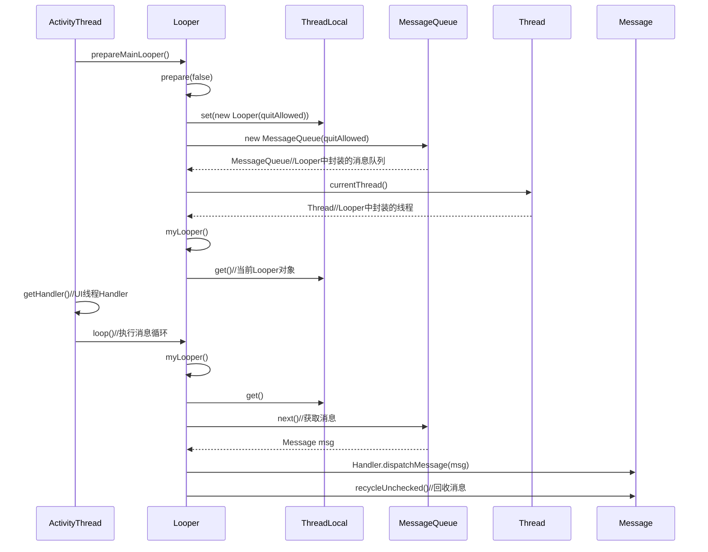

```mermaid
sequenceDiagram
ActivityThread->>Looper:prepareMainLooper()
Looper->>Looper:prepare(false)
Looper->>ThreadLocal:set(new Looper(quitAllowed))
Looper->>MessageQueue:new MessageQueue(quitAllowed)
MessageQueue-->>Looper:MessageQueue//Looper中封装的消息队列
Looper->>Thread:currentThread()
Thread-->>Looper:Thread//Looper中封装的线程
Looper->>Looper:myLooper()
Looper->>ThreadLocal:get()//当前Looper对象
ActivityThread->>ActivityThread:getHandler()//UI线程Handler
ActivityThread->>Looper:loop()//执行消息循环
Looper->>Looper:myLooper()
Looper->>ThreadLocal:get()
Looper->>MessageQueue:next()//获取消息
MessageQueue-->>Looper: Message msg
Looper->>Message:Handler.dispatchMessage(msg)
Looper->>Message:recycleUnchecked()//回收消息
```
